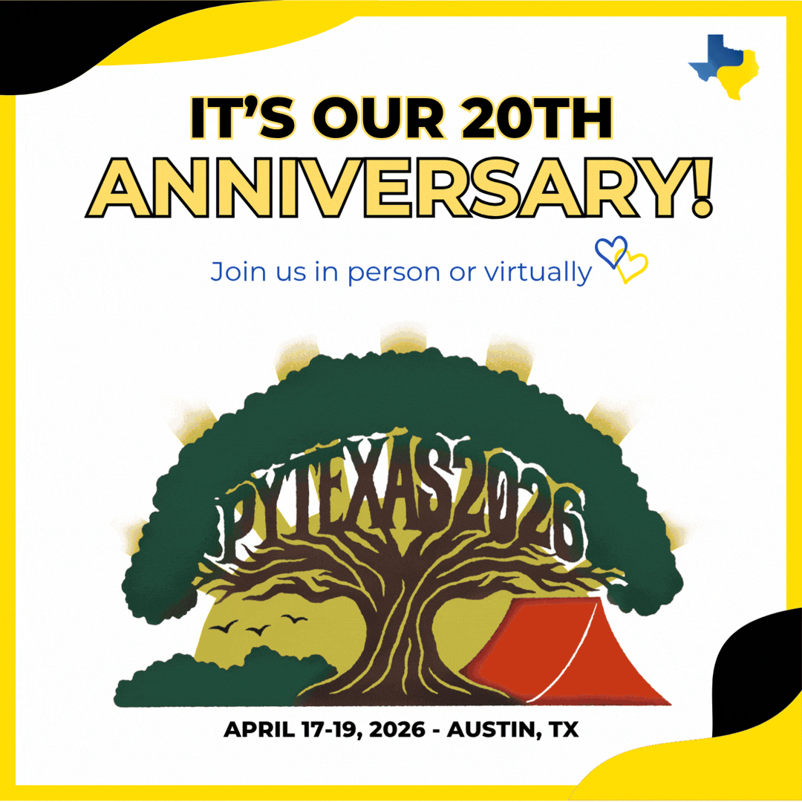

# About

This page is to provide you with the recording & resource(s) provided as part of the [PyTexas 2026 conference](https://www.pytexas.org/2026/){target="_blank" rel="noopener"}.

If you're looking to learn more about Kassandra, you can check out her blog [here](https://prosperousheart.com/){target="_blank" rel="noopener"} or her digital résumé [here](http://resume.prosperousheart.com/){target="_blank" rel="noopener"}. You can also connect with her on any social media platform under the handle **_ProsperousHeart_**:

- [BlueSky](https://bsky.app/profile/prosperousheart.bsky.social){target="_blank" rel="noopener"}
- [Fosstodon / Mastodon](https://fosstodon.org/@ProsperousHeart){target="_blank" rel="noopener"}
- [Instagram](http://prosperousheart.com/instagram){target="_blank" rel="noopener"}
- LinkedIn ([Personal](https://www.linkedin.com/in/kkeeton/){target="_blank" rel="noopener"} and [Page](http://prosperousheart.com/linkedin){target="_blank" rel="noopener"})
- [Twitter / X](http://prosperousheart.com/twitter){target="_blank" rel="noopener"}
- [YouTube](http://prosperousheart.com/youtube){target="_blank" rel="noopener"}

# Resources

## Replay

When available, the replay will be shared here.

The conference is April 17-19, 2026. (Even if you can't attend in person, virtual seats still available on [the site](https://pytexas.org/2026){target="_blank" rel="noopener"}!)

There will be additional production time for the final recordings to become available. As soon as I know, will ensure to update this page.

## The Deck

A special [contest](https://canva.link/pytexas2026-talkgame){target="_blank" rel="noopener"} is being done for the conference. As it requires that attendees pay attention to the talk in order to win, the deck will not be shared until the contest submission time period is over.

  <iframe loading="lazy" style="position: absolute; width: 100%; height: 100%; top: 0; left: 0; border: none; padding: 0;margin: 0;"
    src="https://www.canva.com/design/DAHGs-0zVD0/jo0iHGkyUFfJ__fKWdwMbA/view?embed" allowfullscreen="allowfullscreen" allow="fullscreen">
  </iframe>

You can expect the deck to become available within 2-3 business days after the event. (Possibly sooner. I am a first time speaker as well as an event organizer this year & will be driving 3+ hours or so to/from the event.)

Thank you for your patience & I hope to see you in the Discord channel!

If you haven't yet (& it's the only way you can win the contest) then join us in the PyTexas Discord [here](https://discord.gg/pytexas){target="_blank" rel="noopener"}. 💛

# Additional Conference Sessions

Original replay is [here](https://www.pytexas.org/2026/schedule/talks/#python-in-the-browser-building-interactive-documentation-with-mkdocs-jupyterlite){target="_blank" rel="noopener"}, along with the other sessions.